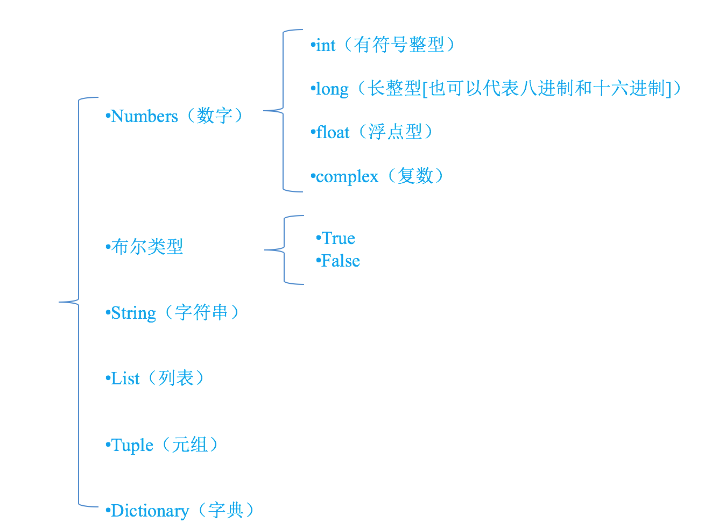

# Python 入门教程

<!-- TOC -->
- [Python 入门教程](#python-入门教程)
  - [1. Python 介绍及环境配置](#1-python-介绍及环境配置)
    - [1.1. (Optional) Python 的一些介绍](#11-optional-python-的一些介绍)
      - [1.1.1. 优点](#111-优点)
      - [1.1.2. 缺点](#112-缺点)
    - [1.2. 开发环境安装配置](#12-开发环境安装配置)
      - [1.2.1. Anaconda/Miniconda 安装及环境配置](#121-anacondaminiconda-安装及环境配置)
      - [1.2.2. 下载并安装](#122-下载并安装)
      - [1.2.3. (Optional) 镜像配置](#123-optional-镜像配置)
      - [1.2.4. (Optional) 虚拟开发环境](#124-optional-虚拟开发环境)
      - [1.2.5. 准备工作](#125-准备工作)
  - [2. 基本的入门](#2-基本的入门)
    - [2.1. 数据类型和基本操作](#21-数据类型和基本操作)
      - [2.1.1. 注释](#211-注释)
      - [2.1.2. 变量](#212-变量)
      - [2.1.3. 标示符和关键字](#213-标示符和关键字)
      - [2.1.4. 基础运算符](#214-基础运算符)
      - [2.1.5. 其他代码规范](#215-其他代码规范)
      - [2.1.6. 字符串](#216-字符串)
      - [2.1.7. 列表](#217-列表)
      - [2.1.8. 元组](#218-元组)
      - [2.1.9. 集合、字典](#219-集合字典)
    - [2.2. 流程控制](#22-流程控制)
      - [2.2.1. 判断](#221-判断)
      - [2.2.2. 循环](#222-循环)
    - [2.3. 函数](#23-函数)
    - [2.4. 了解一些常用函数](#24-了解一些常用函数)
  - [3. 初步进阶内容](#3-初步进阶内容)
    - [3.1. 文件操作](#31-文件操作)
    - [3.2. 面向对象编程](#32-面向对象编程)
  - [4. 常用包](#4-常用包)
    - [4.1. collections](#41-collections)
    - [4.2. NumPy/SciPy](#42-numpyscipy)
    - [4.3. Pandas](#43-pandas)
    - [4.4. Matplotlib/Seaborn](#44-matplotlibseaborn)
  - [5. 参考资料](#5-参考资料)
    - [5.1. MOOC](#51-mooc)
    - [5.2. 图书（电子版）](#52-图书电子版)
    - [5.3. 其他](#53-其他)


## 1. Python 介绍及环境配置

### 1.1. (Optional) Python 的一些介绍

Python 的优缺点

#### 1.1.1. 优点

- **简单** Python是一种代表简单主义思想的语言。阅读一个良好的 Python 程序就感觉像是在读英语一样，尽管这个英语的要求非常严格！Python 的这种伪代码本质是它最大的优点之一。它使你能够专注于解决问题而不是去搞明白语言本身。
- **易学** 就如同你即将看到的一样，Python极其容易上手。前面已经提到了，Python 有极其简单的语法。
- **免费、开源** Python 是 FLOSS(自由/开放源码软件)之一。简单地说,你可以自由地发布这个软件的拷⻉、阅读它的源代码、对它做改动、把它的一部分用于新的自由软件中。FLOSS 是基于一个团体分享知识的概念。这是为什么 Python 如此优秀的原因之一——它是由一群希望看到一个更加优秀的Python的人创造并经常改进着的。
- **高层语言** 当你用 Python 语言编写程序的时候，你无需考虑诸如如何管理你的程序使用的内存一类的底层细节。
- **可移植性** 由于它的开源本质，Python 已经被移植在许多平台上(经过改动使它能够工作在不同平台上)。如果你小心地避免使用依赖于系统的特性，那么你的所有 Python 程序无需修改就可以在下述任何平台上面运行：Linux、Windows、FreeBSD、Macintosh、Solaris、OS/2、Amiga、AROS、AS/400、BeOS、OS/390、z/OS、Palm OS、QNX、VMS、Psion、Acom RISC OS、VxWorks、PlayStation、Sharp Zaurus、Windows CE甚至还有PocketPC、Symbian 以及Android平台！
- **解释性** 这一点需要一些解释。一个用编译性语言比如C或C++写的程序可以从源文件(即C或C++语言)转换到一个你的计算机使用的语言(二进制代码，即0和1)。这个过程通过编译器和不同的标记、选项完成。当你运行你的程序的时候，连接/转载器软件把你的程序从硬盘复制到内存中并且运行。而 Python 语言写的程序不需要编译成二进制代码。你可以直接从源代码运行程序。在计算机内部，Python 解释器把源代码转换成称为字节码的中间形式,然后再把它翻译成计算机使用的机器语言并运行。事实上，由于你不再需要担心如何编译程序，如何确保连接转载正确的库等等，所有这一切使得使用 Python 更加简单。由于你只需要把你的 Python 程序拷⻉到另外一台计算机上,它就可以工作了，这也使得你的Python程序更加易于移植。
- **面向对象** Python 既支持面向过程的编程也支持面向对象的编程。在“面向过程”的语言中，程序是由过程或仅仅是可重用代码的函数构建起来的。在“面向对象”的语言中,程序是由数据和功能组合而成的对象构建起来的。与其他主要的语言如C++和Java相比，Python以一种非常强大又简单的方式实现面向对象编程。
- **可扩展性** 如果你需要你的一段关键代码运行得更快或者希望某些算法不公开，你可以把你的部分程序用C或C++编写，然后在你的 Python 程序中使用它们。
- **丰富的库** Python 标准库确实很庞大。它可以帮助你处理各种工作，包括正则表达式、文档生成、单元测试、线程、数据库、网⻚浏览器、CGI、FTP、电子邮件、XML、XML-RPC、HTML、WAV文件、密码系统、GUI(图形用户界面)、Tk和其他与系统有关的操作。只要安装了 Python，所有这些功能都是可用的。这被称作 Python 的“功能⻬全”理念。除了标准库以外，还有许多其他高质量的库，如 wxPython、Twisted 和 Python 图像库等等。
- **规范的代码** Python 采用强制缩进的方式使得代码具有极佳的可读性。

#### 1.1.2. 缺点

- **运行速度** 有速度要求的话，用C++改写关键部分吧。
- **国内市场较小** 国内还是以 Java 开发为主。但时间推移，目前很多国内软件公司，尤其是游戏公司，也开始
规模使用 Python。
- **中文资料匮乏(好的Python中文资料屈指可数)** 托社区的福，有几本优秀的教材已经被翻译了，但入⻔级教材多，高级内容还是只能看英语版。
- **构架选择太多** 没有像 C# 这样的官方.net构架，也没有像 Ruby 由于历史较短,构架开发的相对集中。不过这也从另一个侧面说明，Python 比较优秀，吸引的人才多，项目也多。


### 1.2. 开发环境安装配置

#### 1.2.1. Anaconda/Miniconda 安装及环境配置

**(Optional) Anaconda VS Miniconda**
> 两者没有本质区别，Miniconda 是一个 Anaconda 的轻量级替代，默认只包含了 `python` 和 `conda` 命令工具，但是可以通过 `pip` 和 `conda` 来安装所需要的包。（Miniconda 安装包下载地址：https://mirrors.tuna.tsinghua.edu.cn/anaconda/miniconda/)

**对于初学者，请直接按照后面的流程安装 Anaconda。**

#### 1.2.2. 下载并安装

- 直接下载：访问官网的[下载地址](https://www.anaconda.com/products/individual#Downloads)，根据相应的操作系统选择下载包。
- 镜像站下载：若直接下载速度缓慢，请到[镜像站](https://mirrors.tuna.tsinghua.edu.cn/anaconda/archive/)进行下载。（在页面内以关键字"2020"进行搜索，确保下载最新的版本）

安装过程和安装普通软件一致，详细内容可以参考[官方文档](https://docs.anaconda.com/anaconda/install/)。在安装的过程中，若：
- 提示 PyCharm/VSCode 等软件的安装，可以先不安装，之后还能再按需安装；
- 出现添加环境变量的提示（`Add Anaconda to my PATH environment variable`），请勾选。

对于初次接触 Anaconda 的朋友，请先阅读官方的[快速入门](https://docs.anaconda.com/anaconda/user-guide/getting-started/)，和[Navigator介绍](https://docs.anaconda.com/anaconda/navigator/)。

#### 1.2.3. (Optional) 镜像配置

Anaconda 安装好之后，便可以进行开发。时常，进行开发的时候，需要进行一些工具包的安装。通常，直接使用 `conda` 和 `pip` 进行包的安装会遇到下载缓慢的问题，这时，可以通过配置镜像源进行加速，这一部分内容可以在熟练后回头来看。具体的配置方法请见官方文档：
- `conda` 的镜像加速：[Anaconda 镜像使用帮助](https://mirrors.tuna.tsinghua.edu.cn/help/anaconda/)
- `pip` 的镜像加速：[pypi 镜像使用帮助
](https://mirrors.tuna.tsinghua.edu.cn/help/pypi/)

一般首选使用 `conda` 进行包管理，因为简单方便，但有些包只能通过 `pip` 进行安装，不过这种现象越来越少了。

#### 1.2.4. (Optional) 虚拟开发环境

如同 JDK，Python 也有很多版本，不同版本间有略微差异。在 Python 中，可以通过虚拟环境管理来进行开发版本的选择。可以把虚拟环境想象成一套独立的开发环境配置，而不用关心安装了不同版本的 Python 会产生冲突。此外，一些教程和已有的工程项目有对应的 Python 版本，有时直接拿来用会出错，这时就需要创建对应 Python 版本的虚拟环境进行开发。

在 Python 中有原生的虚拟环境管理工具 [venv](https://docs.python.org/3/library/venv.html)，然而，对于 Anaconda/Miniconda，可以直接使用其提供的虚拟环境工具进行方便管理。如下图所示，我们可以创建一个新的名为 'tensorflow' 的 Python 虚拟环境。


（环境名称及 Python 版本可根据需求自行进行调整）

创建好虚拟环境后，可以搜索所需包进行安装。

**需要注意的是，默认的环境（base(root)），中已经预先安装了可用的安装环境，若直接采用该虚拟环境，可以跳过下一步工作，直接在 Navigator 的 Home （左侧）中，启动 Jupyter 进行工作。**

#### 1.2.5. 准备工作

Python 是一种脚本语言，可通过解释器直接运行相关代码，不需要进行编译等准备工作。可以使用任意编辑器创建后缀名为 `.py` 的文件进行开发，也可以通过REPL(Read Eval Print Loop，交互式解释器)进行开发。

综合考虑趣味性和将来的数据可视化部分，将采用 Jupyter 进行代码工作。

如下图所示的 Navgiator 主页中，点击启动 Jupyter 之后，浏览器会弹出 Jupyter 工作界面。


按照下图的方式，新建一个 Python 交互笔记。


在新的笔记界面中，输入下面的代码，并按 `Ctrl`+`Enter` 执行代码。

```Python
print('Hello World')
```

这就是你的第一行 Python 代码。

一些 Jupyter 的快捷键可以熟悉一下，按照下图的方式可以查看。


比较常用的快捷键：
- `Ctrl`+`Enter` 执行当前输入单元
- `Shift`+`Enter` 执行当前输入单元并将光标移至下一输入单元

## 2. 基本的入门

### 2.1. 数据类型和基本操作

#### 2.1.1. 注释

一个良好的代码习惯是写必要和规范的注释。注释内容一般会被解释器忽略，除了个别特殊的注释，目前不必深究。
在Python 语法中，注释方法可以分为：
1. 以`#`开头的单行注释
```Python
x = 1 # 这是单行注释，这里变量 x 赋值为 1
```
2. 以一对`'''`或者`"""`包裹的多行注释
```Python
'''
这是
多行
注释
'''

print("一行代码")

"""
这也是
多行
注释
"""
```

注意：**三引号对必须匹配。**


#### 2.1.2. 变量

在 Python 中，存储一个数据，需要一个叫做**变量**的东⻄：

```Python
x = 2     # 变量 x 赋值为 2
y = 3     # 变量 y 赋值为 3
z = x + y # 变量 z 赋值为 x+y=5
```

程序用来处理数据，而变量是用量存储数据的。为了充分利用内存空间以及更有效率地管理内存，变量有不同的类型：



怎样知道一个变量的类型呢？
- 在python中，只要定义了一个变量，而且它有数据，那么它的类型就已经确定了，不需要咱们开发者主动的去说明它的类型，系统会自动辨别
- 可以使用`type`函数，来查看变量的类型


可以看到，x 是字符串类型，y 是整数类型。

#### 2.1.3. 标示符和关键字

标示符是开发人员在程序中自定义的一些符号和名称，是自己定义的，如变量名 、函数名等。

标示符由字母、下划线和数字组成，且数字不能开头。Python 中的标识符是**区分大小写**的

命名要见名知意，起一个有意义的名字，尽量做到看一眼就知道是什么意思(提高代码可 读性) 比如: 名字 就定义为 `name` , 定义学生 用 `student`。推荐用下划线“_”来连接所有的单词，比如`student_name`。

关键字是 Python 一些具有特殊功能的标示符，是 Python已经使用的了，所以不允许开发者自己定义和关键字相同的名字的标示符。查看关键字的方法如下：


在 Jupyter 中，可以使用`?`+`你想查看的内容`来查看变量及函数的用法。


是不是非常方便。

#### 2.1.4. 基础运算符

下面以`a,b`变量说明基础运算符。

```Python
a = -10
b = 20
```

|算术运算符|描述|实例|
|:---:|:---:|---|
|`+`	|加	|两个对象相加 `a + b` 输出结果 `30`|
|`-`	|减	|得到负数或是一个数减去另一个数 `a - b` 输出结果 `-10`|
|`*`	|乘	|两个数相乘或是返回一个被重复若干次的字符串 `a * b` 输出结果 `200`|
|`/`	|除	|` b / a` 输出结果 `2`|
|`%`	|取余|	返回除法的余数 `b % a` 输出结果 `0`|
|`**`	|幂	|  `a**b` 为10的20次方， 输出结果 `100000000000000000000`|
|`//`|	取整除	|返回商的整数部分 `9//2` 输出结果 `4`|

|赋值运算符|	描述|	实例|
|:---:|---|---|
|`=`	|赋值运算符|	把`=`号右边的结果赋给左边的变量|
|`+=`	|加法赋值运算符	|`c += a` 等效于 `c = c + a`|
|`-=`	|减法赋值运算符	|`c -= a` 等效于 `c = c - a`|
|`*=`	|乘法赋值运算符	|`c = a` 等效于 `c = c a`|
|`/=`	|除法赋值运算符	|`c /= a` 等效于 `c = c / a`|
|`%=`	|取模赋值运算符	|`c %= a` 等效于 `c = c % a`|
|`**=`	|幂赋值运算符	|`c **= a` 等效于 `c = c ** a`|
|`//=`	|取整除赋值运算符	|`c //= a` 等效于 `c = c // a`|

Python 支持多变量同时赋值

```Python
a, b, c = 1, 2, 3
```

应用：可以简化变量的值交换

```Python
a, b = b, a
```

#### 2.1.5. 其他代码规范

1. 每一行代码都要和上一行对齐，遇到函数、流程控制则在下一行进行缩进，使代码出现“块状”，没有正确缩进的代码将引起出错。好在 Jupyter 会自动完成缩进的功能。
2. 推荐在运算符号两侧各保留一个空格。

#### 2.1.6. 字符串

双引号或者单引号中的数据，就是字符串

```Python
b = "hello world"
# 或者
b = 'hello world'
```
- f-string 的格式化输出(`f"xxxx {}xxx"`)，取代 `%` 以及 `str.format()`

- 通过 `join` 来拼接字符串：


其他常见操作：
1. `find`
2. `index`
3. `count`
4. `replace`
5. `split`
6. `startswith`/`endswith`

练习：
用搜索引擎找一下这些函数的用法和实例。

#### 2.1.7. 列表

列表、元组、字典是 Python 较为基础的数据结构，列表和元组的区别是列表赋值后可以修改，而元组不能。皆可用 `in` 进行`for`遍历。

特别要注意，使用 listcomp 不仅结构紧凑，而且效率高，是 Python 的特征。

计算：

$$
a = \sum_{i=1}^{100} i
$$

```Python
a = sum([i for i in range(1, 101)])  # sum 是内置函数，传入参数是可迭代的变量，包括 list, tuple，因此，可以写成下面的形式
a = sum(i for i in range(1, 101))
```

列表常用的函数，具体用法的操作作为课后自习：
1. `append`
2. `pop`
3. `len`
4. `max`
5. `min`
6. `sum`
7. `extend`
8. `index`
9. `+` (多个列表进行合并)
10. `*` (列表元素重复)


注意，上面有一个坑，如果我们把`b`中的某个子列表进行修改，会怎样？


这是因为，每一个子列表是同一个列表的引用。所以，尽量不要这样定义多重列表。

> 这里既然提到了迭代器，就稍微讲一下，使用`()`生成的 listcomp 可以看作迭代器，迭代器的好处是，lazy computation，就是取出元素的时候才参与计算，而非一开始就把变量写进内存，省时省空间。这对于处理海量数据是至关重要的，目前可以不用深究，可以在熟练了以后，再搜索相关资料。

#### 2.1.8. 元组

元组几乎和列表一样，只是赋值后就不能进行修改了。

#### 2.1.9. 集合、字典

集合的定义，就是数学中集合的定义。

```Python
a = set([])   # 定义空集
b = {1,2,3}   # 初始化一个集合
```

集合支持操作：
1. `&` 交
2. `|` 并
3. `-` 差
4. `add`/`remove` 添加，删除元素。

集合是无序的，但是检查元素是否在集合中（`in`）的速度很快，每次遍历的顺序可能不同。

字典是集合的一种拓展，字典是“键-值”对作为元素，即字典的“键”必须唯一。

```Python
info = {} # 创建空字典，而非空集合！！
info = {'name':'班长', 'id':100, 'sex':'f', 'address':'地球亚洲中国北京'} # 初始化字典

print(info['name'])         # 通过 键 访问字典中的变量
print(info['address'])
```

字典的常见操作，具体用法请搜索，作为课后练习。
1. `keys`
2. `values`
3. `items`

### 2.2. 流程控制

#### 2.2.1. 判断

一个典型的条件分支判断流程为：

```Python
if condition:
  [do something]
else:               # 可以没有else分支
  [do other thing]  
```

condition 部分需要用到比较、关系运算符

|比较运算符|	描述|	示例|
|:-----:|---|---|
|`==`|	检查两个操作数的值是否相等，如果是则条件变为真。|	如`a=3,b=3`则 `a == b` 为 `True`.|
|`!=`|	检查两个操作数的值是否相等，如果值不相等，则条件变为真。|	如`a=1,b=3`则 `a != b` 为 `True`.|
|`>`| 检查左操作数的值是否大于右操作数的值，如果是，则条件成立。|	如`a=7,b=3`则 `a > b`  为 `True`.|
|`<`	|检查左操作数的值是否小于右操作数的值，如果是，则条件成立。|	如`a=7,b=3`则 `a < b` 为 `False`.|
|`>=`|	检查左操作数的值是否大于或等于右操作数的值，如果是，则条件成立。|	如`a=3,b=3`则`a >= b`为 `True`.|
|`<=`|	检查左操作数的值是否小于或等于右操作数的值，如果是，则条件成立。|	如`a=3,b=3`则 `a <= b` 为 `True`.|

```Python
a, b = 10, 20
```

|逻辑运算符 |逻辑表达式|	描述|	实例|
|:----:|:-----:|----|----|
|`and`|	`x and y`	| 布尔"与"，如果 `x` 为 `False`，`x and y` 返回 `False`，否则它返回 `y` 的计算值。	|`a and b` 返回 `20`。|
|`or`|	`x or y`	| 布尔"或", 如果 `x` 是 `True`，它返回 `True`，否则它返回 `y` 的计算值。|	 `a or b` 返回 `10`|
|`not`|	`not x` |	布尔"非"，如果 `x` 为 `True`，返回 `False` 。如果 `x` 为 `False`，它返回 `True`。| 	`not(a and b)` 返回 `False`|

判断可以进行嵌套，但为了提高可读性，尽量不要嵌套一大堆。

#### 2.2.2. 循环

主要的两种循环为 `for` 与 `while`。

计算：

$$
a = \sum_{i=1}^{100} i
$$

使用 `for`
```Python
a = 0
for i in range(1, 101):   # range(起始值,步长[可省略，默认为1]，终止值-1)
  a += i
print(a)
```

使用 `while`
```Python
a = 0
i = 0
while i < 100:
  i += 1
  a += i
print(a)
```

循环过程可以结合流程判断进行调整，其中：

1. `break` 关键字表示直接结束整个循环
2. `continue` 关键字表示跳过当前循环，进入下一轮循环
3. `break/continue`只能用在循环中，除此以外不能单独使用
4. `break/continue`在嵌套循环中，只对最近的一层循环起作用

计算：

$$
a = \sum_{i=1}^{49} + \sum_{i=51}^{100}
$$

使用 `for`
```Python
a = 0
for i in range(1, 101):   # range(起始值,步长[可省略，默认为1]，终止值-1)
  if i == 50:
    continue
  a += i                  # 由于 continue 会跳出当前循环，因此不用加 else 也可以
print(a)
```

使用 `while`
```Python
a = 0
i = 0
while i < 100:
  i += 1
  if i == 50:
    continue
  a += i
print(a)
```


### 2.3. 函数

所谓函数，就是指：把某些特定功能的代码组成为一个整体，这个整体就叫做函数。
定义函数格式如下:

```Python
def test():
    print('----哈哈----')
    print('----这是我的第一个函数----')
```

如果仅仅是定义了函数，其实是不能自动被执行的，必须要去调用它才可以。通俗的讲：定义函数相当于打造了一个工具，调用函数相当于使用这个工具完成想要做的事情。

```Python
# 调用函数
test()
```

带有参数的函数：
```Python
def test(a, b):
  return a + b

# 调用函数
c = test(1, 2)   # c = 3
```

Python 是不用申明类型的，因此，很多时候，需要自己注意。有一种写法，虽然也不检查变量类型，但是增加了可读性（推荐这么写）：
```Python
def test(a: int, b: int) -> int :
  return a + b
```
需要注意的是，函数可以定义初始值，不传这个参数的话，就用定义的默认值：
```Python
def test(a: int, b: int = 5) -> int:
  return a + b
# 调用
c = test(1)   # c = 6
c = test(1,3) # c = 4, 等价于 test(1, b=3)
```

思考并搜索：变量有名字的时候，顺序重要吗？

Python 的匿名函数也称为 lambda 函数，因为它这么定义：

```Python
f = lambda x: x+1
```

lambda 函数一般不推荐使用，因为可读性太差了，但是有些传入函数作为参数的函数可以这么使用，当然，写一个正常函数也是可以的。比如，想要将字典 `a` 中的项目根据值排序，返回键组成的列表：

此外，在函数式编程（流式）中，也常常会用到 lambda 函数。
我的建议是，能不用lambda，尽量不用，除非这个地方用 lambda 真的很方便（摊手）。

说到函数，就要讲到变量定义域、闭包，这个真不是我能简单讲明白的，而且算是进阶内容了，所以，以下课后作业一定要认真做：
1. 说说变量定义域是怎么回事。
2. (Optional)说说啥是闭包，好处都有啥。
3. `*kargs, **kwargs` 会经常在别人源码中的函数定义看到，是什么呀？

### 2.4. 了解一些常用函数

1. `map`
2. `enumerate`
3. `zip`及其逆操作`*`

请阅读：
1. [zip 函数](https://www.programiz.com/python-programming/methods/built-in/zip)
2. [map 函数](https://realpython.com/python-map-function/)


## 3. 初步进阶内容

### 3.1. 文件操作

Python 的文件操作可以使用内置的 `open` 函数，需要注意操作完成后要关闭。因此，一般采用上下文管理来做。

```Python
with open("test.txt", "w") as f:
  x = "hello"
  f.write(x)
```

相关阅读：
1. [with 在 Python 中的作用](https://stackoverflow.com/questions/1369526/what-is-the-python-keyword-with-used-for)
2. [Python文件操作，看这篇就足够](https://zhuanlan.zhihu.com/p/56909212)

### 3.2. 面向对象编程

面向对象编程是比较重要的一部分，其内容非常多。但是对于数据科学来说，以了解为主，并不是经常要自己写一个类。

相关阅读：
1. [廖雪峰——面向对象编程](https://www.liaoxuefeng.com/wiki/1016959663602400/1017495723838528)

## 4. 常用包

### 4.1. collections

`collections` 是 Python 内置库中非常好用的包，可以通过下面的方式导入使用：

```Python
from collections import namedtuple
```

1. `namedtuple`: 生成可以使用名字来访问元素内容的tuple子类
2. `deque`: 双端队列，可以快速的从另外一侧追加和推出对象
3. `Counter`: 计数器，主要用来计数
4. `OrderedDict`: 有序字典
5. `defaultdict`: 带有默认值的字典

请阅读：
1. [不可不知的Python模块: collections](https://www.zlovezl.cn/articles/collections-in-python/)
2. [廖雪峰 Python 教程](https://www.liaoxuefeng.com/wiki/1016959663602400/1017681679479008)
3. [官方文档](https://docs.python.org/3/library/collections.html)

### 4.2. NumPy/SciPy

进行科学计算的包

请阅读：

1. [Numpy 快速入门教程](https://www.numpy.org.cn/user/quickstart.html)

### 4.3. Pandas

强大的数据处理包

请阅读：
1. [Pandas 入门](https://pda.readthedocs.io/en/latest/chp5.html)

### 4.4. Matplotlib/Seaborn

- 强大的绘图包 `Matplotlib`
- 强大的数据可视化包 `Seaborn`

请阅读：

1. [Matplotlib Toturials](https://matplotlib.org/tutorials/index.html)
2. [Seaborn User Guide](https://seaborn.pydata.org/tutorial.html)

## 5. 参考资料

### 5.1. MOOC

以下课程皆可不领证书免费听课。

1. [Python Data Science](https://www.edx.org/professional-certificate/python-data-science)
2. [Applied Data Science with Python](https://www.coursera.org/specializations/data-science-python)
3. [Python for Everybody](https://www.coursera.org/specializations/python)

注：[Coursera](https://www.coursera.org), [Udacity](https://www.udacity.com), [Edx](https://www.edx.org) 等 MOOC 平台可以自行课程搜索。


### 5.2. 图书（电子版）

[网盘分享 ^_^](https://pan.zju.edu.cn/share/d832c1bab19c4fd61d945773c6)

1. Python 基础教程
2. Python 核心编程
3. Python 数据科学入门
4. 利用 Python 进行数据分析
5. Python 网络数据采集
6. Python 数据科学手册
7. Python 数据可视化编程实战
8. Python 数据分析基础教程：NumPy学习指南
9. Python3 网络爬虫数据采集
10. NumPy 攻略 Python 科学计算与数据分析


### 5.3. 其他

1. [Python 基础教程|菜鸟教程](https://www.runoob.com/python/python-tutorial.html)
2. [廖雪峰的 Python 教程](https://www.liaoxuefeng.com/wiki/1016959663602400)
3. [Python 官方文档](https://docs.python.org/zh-cn/3/)